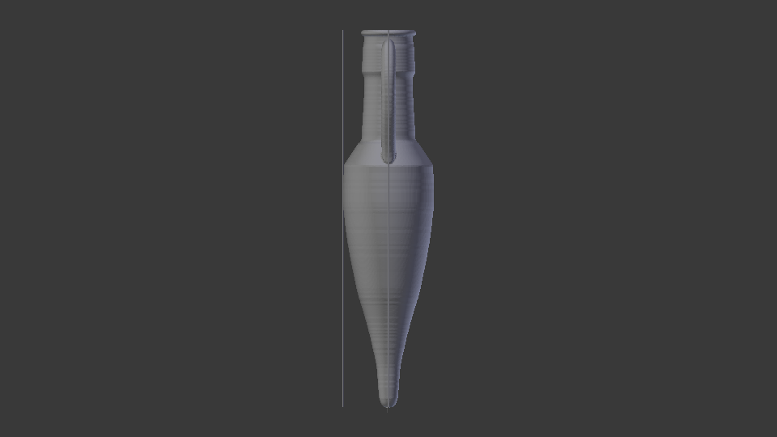
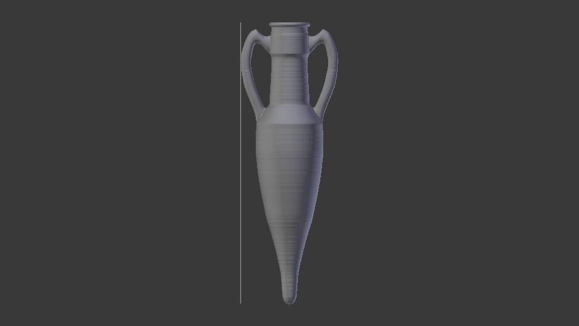
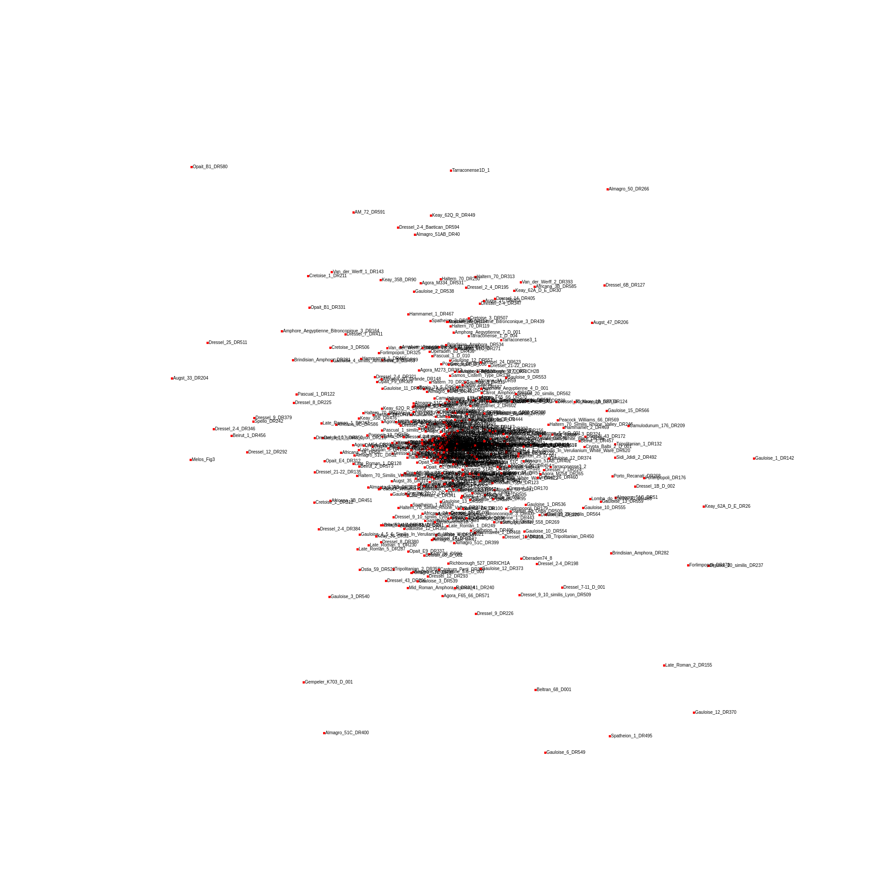
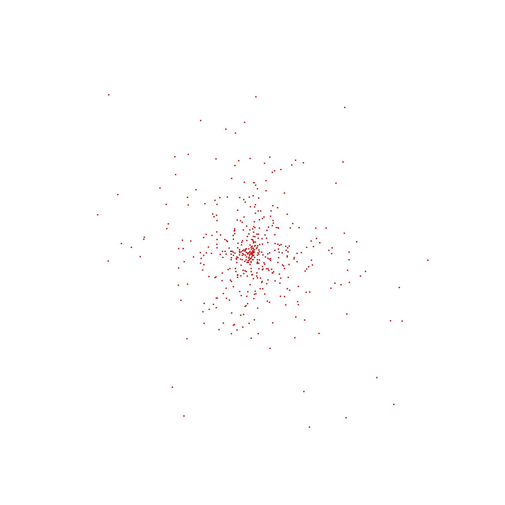

# Inhalt
1. [Röntgenfluoreszenzanalyse Datensatz](#crmcana)
3. [Analyse von 3D Modellen](#3dmodana)

# Voruntersuchungen zum Entwurf einer Scherbenklassifikation

## 1. pRFA / XFA Datensatz  
*(Im Ornder CRMC)*

### 1.1 Datenmaterial und inhaltliche Ausgangslage

Der Umstand, dass die Sammlung keine pRFA Analyse darstellt, sondern Proben in ihrer körperlichen Gänze (WD-XRF) berücksichtigt werden, muss als Beschränkung der Aussagen, die hier getroffen werden kann, berücksichtigt werden.

Grundsätzlich konnte die Forschung bisher zeigen, dass der Vergleich der Molekül-/Elementprofile von keramischen Proben einen Anhaltspunkt für die Provenienz der Töpferwaren anzeigen kann. Dies trifft, hier herrscht Einhelligkeit, auf das Profil der Spurenelemente und teilweise auf das Profil der Metalloxide zu. Daraus lässt sich die Frage, der wir nun nachgehen, anschließen, ob Teile der Molekül-/Elementprofile auch für die Characterisierung der Warenart Anwendung finden könnten. Um die Vermutung mit einem ersten Anhaltspunkt zu untermauern wurde die Datenbank "Ceramic Atlas of Central Europe" (http://repository.edition-topoi.org/collection/CRMC/object/CACE), das hier beschreibende PDF sagt aus:

1. The chemical elements differ in significance and should not be treated equally. Most important are the
major elements expressed as oxides, which are dictated by the kind of clay and temper (Si, Al, Fe, Ca).

2. characterize certain provenances (Ti, K, Mg)

3. This is to be checked with data
obtained by pXRF (portable energy-dispersive XRF) as also for data obtained by ICP-OES, ICP-MS and NAA.

### 1.2 Vorgehen

Grundsätzlich ging es um einen intuitiven Zugang und die Frage, gruppiert ein Profil die Funde der Datenbank so, dass die Warenart eine Gruppe bildet? Zur Umsetzung der Fragestellung benutzen wir ein R Skript, das die Daten aus den CSV Dateien einließt und den Vergleich zwischen Terra Sigillata und Terra Nigra anstellt. Der Vergleich von Profilen gelingt so: Jedes Profil ist eine Reihe von Zahlen, die den Messwert darstellen. Jede Stelle in der List steht für immer das gleiche Element/Molekül. Anschließend werden diese Listen verglichen, dabei werden alle Zahlenwerte gleichzeitig berücksichtigt. Der Vergleich wird mittels einer Zahl ausgedrückt, die entweder aus der Berechnung der Euklidischen Distanz (Manhattan, Canberra, Wasserstein) oder einer anderen Bezifferung dieser Art ableitet. Anschließend werden die Proben danach gruppiert welche verglichen zur einen den kleinsten Zahlenwert aufweist. Dabei genügt es dieses Vorgehen als Dendrogramm darzustellen, um eine lesbare Ausgabe der Zahlenverhältnisse zu bekommen.

Für die Profil- und Distanz-Maß-Kombinationen wurden Manhattan, Euklid, Canberra und Wasserstein in Betracht gezogen (hier in entsprechenden Ordnern als Zwischenergebnisse angegeben). Außerdem wurden folgende Profile erwogen:
Alle: "SiO2", "TiO2", "Al2O3", "Fe2O3", "MnO", "MgO", "CaO", "Na2O", "K2O", "P2O5", "V", "Cr", "Ni", "Cu", "Zn", "Rb", "Sr", "Y", "Zr", "Nb", "Ba", "La", "Ce", "Pb", "Th"
Alle Oxide: "SiO2","TiO2", "Al2O3", "Fe2O3", "MnO", "MgO", "CaO", "Na2O", "K2O", "P2O5"
Metalloxide: "TiO2", "Al2O3", "Fe2O3", "MnO", "MgO"
Nichtmetall und Halbmetalloxide: "SiO2", "CaO", "Na2O", "K2O", "P2O5"
Aus der Literatur: "SiO2", "CaO", "Na2O", "K2O", "MgO", "Fe2O3", "Al2O3"

Die Kombination Euklidische Distanz und das Profil: "SiO2", "CaO", "Na2O", "MgO" ergab ein ziemlich deutliches Dendrogramm.

### 1.3 Ergebnis

Das Dendrogramm weißt die Terra Nigra und die Terra Sigillata auf zwei Seiten mit deutlichem Übergangsbereich aus. Unserer Auffassung nach bedeutet dies, dass es zu erwägen ist die Profile als Indikatoren für die Warenart zu verwenden. Im Rahmen der Arbeit mit gestörten Daten ist es nahe liegend mit weiteren Messwerten aus zerstörungsfreien Methoden diese Ergebnisse zu korrigieren. Es bleibt ebenfalls die Möglichkeit offen die Zusammensetzung in Bezug zur Brennweise und Magerung zu setzen, um Profile besser beurteilen zu können. Unsere Darstellung hier ist nichts weiter als eine Skizze, die zeigt dass sich auch im naiven Fall Andeutungen auf die Verwendbarkeit der Profile abzeichnen.

## 2. 3D Objekte 

*(Im Ordner 3D-Archaide)* 

### 2.1 Datenmaterial und Ausgangslage

3D Models (https://archaeologydataservice.ac.uk/archives/view/archaide_2019/overview.cfm) vom Archaide Projekt (http://www.archaide.eu/).

### 2.2 Vorgehen

Rust-Tool zur Evaluierung des Kurvenverlaufs auf der Oberfläche der 3D Modelle entlang zweier Hauptachsen.

Berechnung des Wasserstein-1D Maß zum Vergleich der Kurvenverläufe der Modelle und tSNE Einbettung zur Herstellung einer graphsichen Repräsentation der Distanzmatrix.

### 2.3 Ergebnis

Das tSNE Cluster Ergebnis wurde in eine interactive Webseite umgewandelt (Mouseover der Cluster-Punkte zeigt den Modellnamen / Amphorentyp, 
Klick auf einen Cluster-Pukt öffnet den Datensatz des 3D model in einem Browser-Tab): http://ecomparatio.net/~khk/scherben/

Beispiel des Clusters:

Zur Zeit gibt es keinen Anhaltpunkt dafür, dass der Kurvenverlauf eine Unterscheidung innerhalb der 3D Objekte zulässt. Es müssen jedoch noch weitere Untersuchungen an der Implementierung vorgenommen werden. Die Orientierung der Polygone, die zur Berechung des Winkeldefekts herangezogen werden, blieb bisher unberücksichtigt. Weitere Einschränkungen der Implemnetierung beeinflussen des Ergebnis. Dies ist ein Zwischenstand (09/2022).
